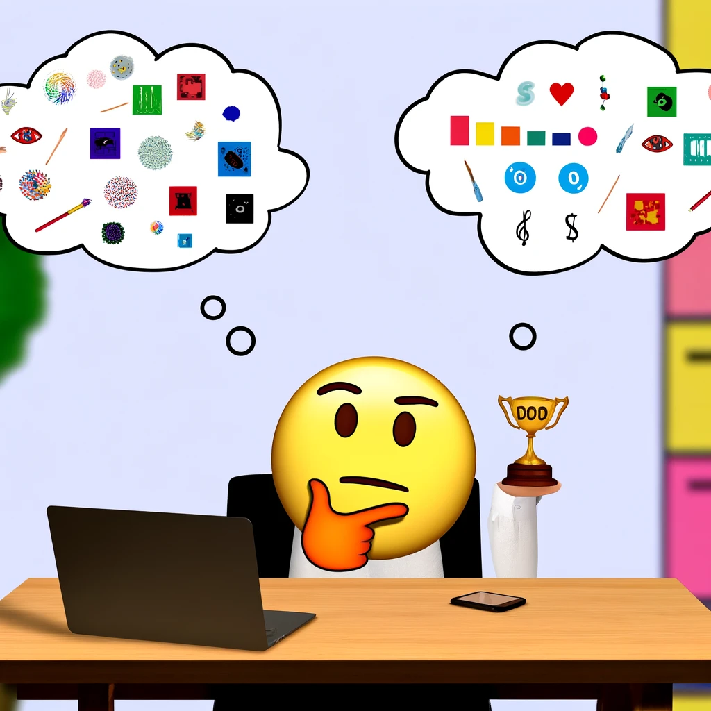

{width="4.478512685914261in"
height="2.6440474628171478in"}

1.  **Define the problem**:

> Decide on what the model should predict{width="0.3472222222222222in"
> height="0.24195975503062117in"} and when it\'s
> successful{width="0.30719160104986876in"
> height="0.18947397200349955in"}

{width="4.70751968503937in"
height="2.9684208223972in"}

2.  **Get the data**:

Find data sources
{width="0.31578958880139985in"
height="0.31578958880139985in"}{width="0.31578958880139985in"
height="0.31578958880139985in"}{width="0.31578958880139985in"
height="0.31578958880139985in"}and get access
{width="0.32553915135608047in"
height="0.24166666666666667in"}

[Three Different data formats]{.underline}

1.  **Tabular** or **structured** data
    {width="0.3889621609798775in"
    height="0.3889621609798775in"}

2.  **Semi-structured** data:

> JSON: { \"deviceId\": 29482, \"location\": \"Office1\",
> \"time\":\"2021-07-14T12:47:39Z\", \"temperature\": 23 }

3.  **Unstructured** data: {width="0.3473687664041995in"
    height="0.3473687664041995in"}{width="0.3473687664041995in"
    height="0.3473687664041995in"}{width="0.35789479440069993in"
    height="0.35789479440069993in"}{width="0.3368416447944007in"
    height="0.3368416447944007in"}

Once you've identified the data source, the original data format, and
the desired data format, then, you can design a data ingestion pipeline
to automatically extract and transform the data you need.

3\. **Prepare the data**: Explore the data. Clean {width="0.3468208661417323in"
height="0.3468208661417323in"}and
transform{width="0.2202121609798775in"
height="0.2202121609798775in"} the data based on the model\'s
requirements.

-   Separate compute from storage

```{=html}
<!-- -->
```
-   Move and transform data

```{=html}
<!-- -->
```
-   **Data ingestion pipeline (**manual or scheduled**):** sequence of
    tasks that move and transform the data

> [Choices to create a pipeline:]{.underline}

-   **Azure Synapse Analytics**/ **Azure Synapse Pipelines:**
    easy-to-use UI, or by defining the pipeline in JSON format.

> Uses different types of computes:
>
> serverless SQL pools, dedicated SQL pools, or Spark pools

-   **Azure Databricks:** If you prefer a code-first tool and to use
    SQL, Python, or R.

> Uses Spark clusters.

-   **Azure Machine Learning:** provide compute clusters, that
    automatically scale up/down.

> **NOTE:** Azure Synapse Analytics and Azure Databricks offer more
> scalable compute 

-   **Azure Cognitive services:** Azure Cognitive Services offer Custom
    Vision to train a custom computer vision model.

-   **Scikit-model**

```{=html}
<!-- -->
```
-   Store data for model training workloads, using any of the below:

    -   **Azure Blob Storage**: Cheapest

> {width="1.4421052055993in"
> height="1.4421052055993in"}

-   **Azure Data Lake Storage (Gen 2)**: also implements a hierarchical
    namespace

> {width="1.3473687664041996in"
> height="1.3473687664041996in"}

-   **Azure SQL Database**:

> {width="2.0369892825896763in"
> height="2.112432195975503in"}

4\. **Train the model**: Choose an algorithm
{width="0.38391294838145235in"
height="0.2619149168853893in"}and hyperparameter values based on trial
and error.

5\. **Integrate the model**: Deploy to an endpoint to generate {width="0.23117672790901136in"
height="0.23117672790901136in"}predictions {width="0.19959755030621174in"
height="0.19959755030621174in"}

6**. Monitor the model**: Track {width="0.31513123359580053in"
height="0.31513123359580053in"} the model\'s performance
